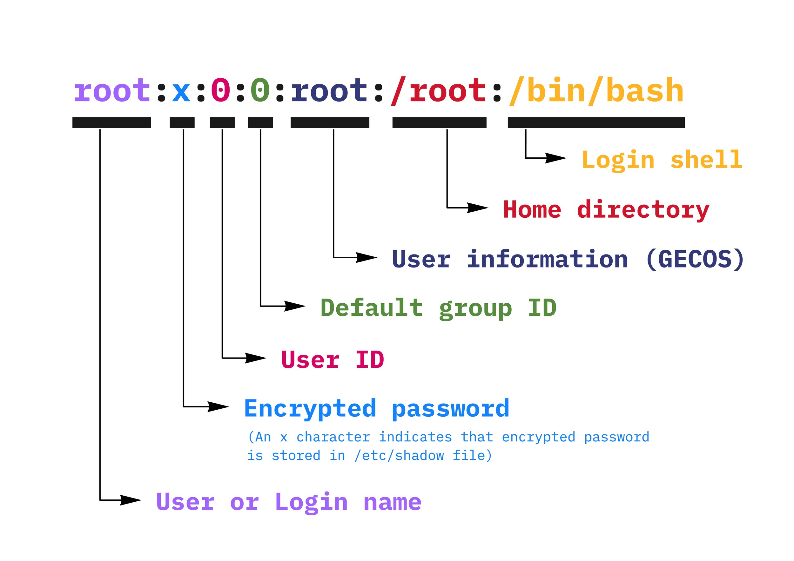
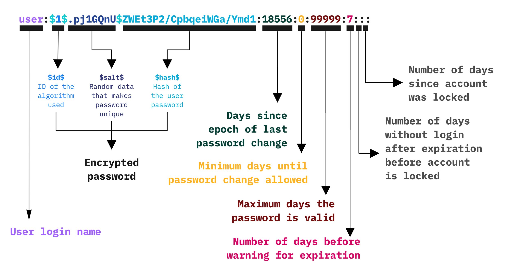

# Passwd & Shadow files

## /etc/passwd


Contains users public data: login name, IDs, home directory location, default shell...


<figure><figcaption></figcaption></figure>

## /etc/shadow


Contains hashed passwords and longevity info&#x20;


<figure><figcaption></figcaption></figure>
