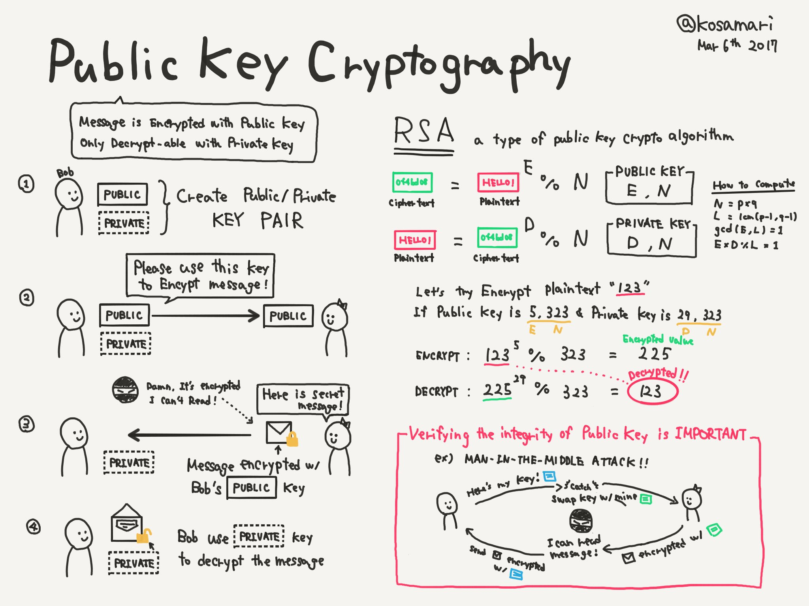

# Symmetric, Asymmetric and Hybrid cryptography

### Symmetric cryptography

Also known as private key cryptography, is characterized for using the same key for both encryption and decryption of data. \
In cryptography a key is a string of alphanumeric characters that will be used as a pivotal piece in an algorithm. The chosen algorithm will scramble data in a random-looking, but in fact precise way, determined by the key. \
Different key strings will produce different outputs. \
The same key string will always produce the same output.\
It can be understood basically as a password because only that key will recover the data to its original state. \
\
Example in communications:

1. Suppose we have the following secret message we want to send: "Tonight meeting at the docks".&#x20;
2. Using specialized software, we proceed to encrypt it with the following key: "UseL0ngP4sswords!1"
3. Our message now looks something like this "Yjq94KmniIi02reN="
4. We can now send it over the internet with total confidence that even if intercepted, nobody will be able to read it unless they know the key.
5. Once the encrypted message arrives at its destination, receiver will use the same key "UseL0ngP4sswords!1" to decrypt the message and read the secret.

But there's a flaw in this method. How do we send the key over securely in the first place? If a bad actor intercepts the key it will have access to all our communications. It would be too much effort to find a secure tunnel or meet with the person to share it every time. Its not realistic for the average user. \
The best solution would be that every system has its own secret key and no need to share it ever.\
And that's why [three](https://en.wikipedia.org/wiki/Whitfield\_Diffie)[smart ](https://en.wikipedia.org/wiki/Martin\_Hellman)[guys](https://en.wikipedia.org/wiki/Ralph\_Merkle) invented asymmetric public key cryptography.\
\
But don't underestimate, symmetric cryptography has a big advantage, it's way more efficient, fast and can be used easily to encrypt storage devices(so full systems) with a password. Also it can be used in conjunction with asymmetric cryptography to send over the symmetric key in a secure way and then both systems can use the same key. This is called hybrid cryptography and uses the best of both worlds, we will understand all of this below.


Popular symmetric cryptography algorithms:&#x20;

* AES (Advanced Encryption Standard): former name Rjindael, by far the most used in the world and "known" to be used in intelligence agencies. Selected and renamed as the standard encryption algorithm in 2001. As the year of writing this, 2023, it keeps being the standard and the best with no significant vulnerabilities.
* DES (Data Encryption Standard): old standard, adopted in 1977 and retired in 2005, the main flaw being the key bit length being too short for today brute force attack standards.
* 3DES (Triple DES): applies DES algorithm 3 times to each data block, fixing the short key length flaw. While less secure and efficient than AES, it's still used in some legacy systems.
* Other secure algorithms not widely adopted because they are less efficient include: Serpent, Twofish, Blowfish, ChaCha20, MARS, IDEA...

While others may be secure, I would always recommend AES as its the most adopted by far. Think of it this way: with the whole world looking for flaws at the same algorithm, if there were, they would already been made public.



Recommended software for storage encryption [VeraCrypt](https://www.veracrypt.fr/en/Home.html)


### Asymmetric cryptography

Also known as public key cryptography, used mostly for securing connections, is the cryptographic method of encrypting or signing data using two different but mathematically related keys, one will be public and the other private. \
The public key will be shared with the world and the private will stay protected in our system. We will detail the process below but as a general definition: data encrypted with the public key will only be decrypted with the private key. This method is widely used, for example, in the TLS/SLL protocol which makes HTTPS connections possible.

As we mentioned, public key encryption uses two different keys in the process. These keys are mathematically related but designed so that one of them can be shared freely (we call it public) and the other must be kept secret(we call it private).\
We will understand it better with the example of Bob and Alice:

1. First Bob and Alice create a public/private key pair. In HTTPS connections for example, the keys are created automatically and will be temporary for an specific connection.
2. Then Bob and Alice interchange public keys. Because they are worthless without its private counterpart you can send them all over the internet.
3. Now that keys are shared in each other systems, Alice will write a message, encrypt it using Bob's public key, and send it over. This means no other key than Bob's private can decrypt that message, and that private key is never shared. So no matter who is eavesdropping the connection, all they will see is gibberish.&#x20;
4. Bob receives the message, decrypts and reads it. He then decides to respond so he writes a message and encrypts it with Alice's public key, and sends it over, repeating the process.

Real life has extra steps, signs and certificates involved, we will see them little by little in next pages.

<figure><figcaption>
source: <a href="https://twitter.com/kosamari/status/838738015010848769">https://twitter.com/kosamari/status/838738015010848769</a> 
</figcaption></figure>


RSA algoritmo explicar


### Hybrid cryptography

Also called hybrid cryptosystem, is&#x20;
