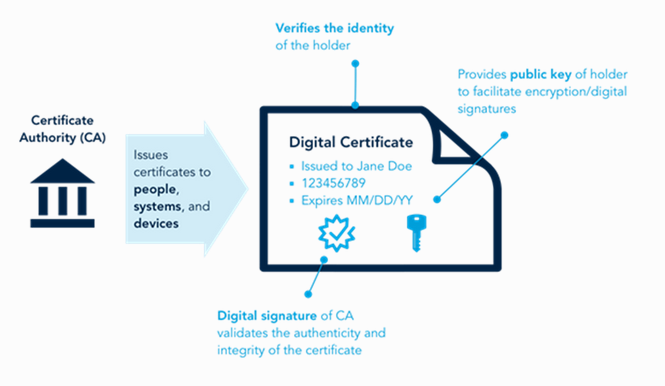

# Digital signatures & Digital certificates

### Digital signatures

Digital signatures use encryption techniques not to hide data([Confidentiality](../cia-triad-confidentiality-integrity-and-availability.md)) but to verify the authenticity and integrity of the data sent over a network. It also has the purpose of creating non-repudiation, meaning that once signed and sent, the user can't deny sending the message. \
The process involves [asymmetric cryptography](symmetric-asymmetric-and-hybrid-cryptography.md) and [hashing](hash-functions.md) to sign the data with an unique mathematical "name" or "code" that can't be changed. Think of it like a DNI for each file or message that demonstrates that the owner is who it says it is.\
If a user wants to send a message using only data encryption, sure, nobody will read it, but a man-in-the-middle attack could intercept the message, stop it, create a new one using its own key pair and send it to the destination passing as if its encrypted by the original user. This is a goldmine for scammers. But this vulnerability is remediated by digital signature.\

Once again we will use our friends Alice and Bob for easier explanation, we will obviate data encryption steps for clarity and concision:

1. Bob wants to send a signed message to Alice, so he generates a key pair and writes the message.
2. Bob then [hashes](hash-functions.md) the message, producing an unique, deterministic and fixed-size string that uniquely represents the content of the message. Even 1 letter change would produce a totally different string.
3. Bob then encrypts the hash digest with his private key. This reverses what we saw on [encryption](symmetric-asymmetric-and-hybrid-cryptography.md), anybody with the public key of Bob can decrypt the message, but only Bob, the only holder of the private key, could have encrypted it. If the public key decrypts the message, it proves its him.
4. The encrypted hash digest, now called signature, is then attached to the original message, encrypted and sent over to Alice.
5. Now Alice has received the message, decrypts the message using its own private key and the digital signature using Bob's public key. Then she uses the same hashing algorithm on the message to compare the results.\
   If Alice can decrypt the signature using Bob's public key it proves authenticity, it's from Bob.\
   If the hash digest of the message and the signature match, it means the message is exactly the same and conserves its full integrity.\
   They matching also creates non-repudiation. Bob can't deny sending that message. Only his private key could have encrypted that matching hash digest.

<figure><figcaption>
source: (Sunny Classroom) <a href="https://www.youtube.com/watch?v=TmA2QWSLSPg">https://www.youtube.com/watch?v=TmA2QWSLSPg</a> 
</figcaption></figure>

But this still has a big vulnerability, digital signature alone can't prove authenticity, since the public key is available for anyone, probably in a public server, a man-in-the-middle attack could intercept the message, the bad actor throws the original message away and send its own, redirecting Alice to his own "pretending to be Bob" public key. Alice receives the message and everything looks correct, the hash and the signature match. But it's not coming from the private key of Bob but from the bad actor, we need a step further. \
\
So far, we created confidentiality: \
The message can't be read until decrypted with asymmetric/symmetric or hybrid cryptography. \
We created integrity: \
We proved that the message isn't altered in transit with hashing and digital signature.\
We proved that the message comes from the same private key that matches the public one.\
\
Now we need the last step, to create authenticity, we have to prove that the public key comes in fact from its legitimate user, but this key has to be public and can't be encrypted. There will always be a trust gap between the sender and the recipient, we need a third party to act as a notary. \
So now we will learn about digital certificates and chains of trust.\

***

### Digital certificates

They are digital credentials issued by a trusted third party, a file, designed to verify the identity of a user (so it is who it says it is) and that it owns the public key attached. Demonstrating the authenticity we were lacking on the other steps. \
We call this third party trust organizations Certificate Authority (CA). They can be commercial entities, governmental, private, etc. CAs act like a notary, an entity with high security politics who is neutral and that can be trusted because if they lie they win nothing and lose a lot. \

<figure><figcaption>
source: <a href="https://www.networkacademy.io/ccie-enterprise/sdwan/cisco-sd-wan-certificates-explained">https://www.networkacademy.io/ccie-enterprise/sdwan/cisco-sd-wan-certificates-explained</a> 
</figcaption></figure>

\
Before issuing a digital certificate, CAs will perform a thorough verification of the entity's identity, it may include validating domain ownership, legal business documentation, government-issued identification documents, phone verification...\
\
The certificate file will have an extension like ".cer", ".crt", ".pem" or ".der" and will contain, encoded, all the needed information about the certificate owner, like its name, public key, validity period, issuer of the certificate and most importantly the digital signature of the CA issuer to prove its legitimate. \
\
Alice and Bob to the rescue:

1. Alice contacts with a CA service and after proving his identify with some sort of info, she gets and downloads the "certificate.cer".
2. Alice sends the message to Bob with the digital certificate attached to it.
3. Bob will decrypt the CA digital signature on the certificate, the public key of the CA can be included or checked online but browsers and OSs come already preinstalled with most major root CA public keys. If the hash matches with the one in the certificate this ensures that the certificate in fact comes from the trusted CA that Alice bought. As only the CA private key could have encrypted it.
4. Once the CA signature is verified, the certificate can be trusted, and if the date of validation is not expired, Bob can trust that the message is in fact coming from Alice, authenticity is proved. \
   The certificate will also already include Alice's public key to use for the rest of the connection. \
   Or in the real world terms, a green padlock appears in your browser's address bar.\

<figure><figcaption>
source: <a href="https://id4d.worldbank.org/guide/digital-certificates-and-pki">https://id4d.worldbank.org/guide/digital-certificates-and-pki</a> 
</figcaption></figure>


A Certificate Authority that you can try for free is [Let's Encrypt](https://letsencrypt.org/), a non-profit organization that issues certificates using domain ownership validation.



You could technically do a self-signed certificate, it will still provide an encrypted connection, but its the equivalent of saying "trust me, I am who I say I am". Also your public key will not come preinstalled in browsers, so it will still warn users about the risks of visiting your site.


Certification Authorities are based on a Distributed Trust Model, or chain of  trust, where root CAs sign intermediate CAs, distributing the load and delegating authority into more entities, so if a key were to be compromised it would not affect the whole of the certificates.

<figure><figcaption>
source: <a href="https://youtu.be/LPxeYtMDxl0?feature=shared">https://youtu.be/LPxeYtMDxl0?feature=shared</a> 
</figcaption></figure>

At some point of the chain the certificate has to be self-signed, this is handled by the root CA, the one that will have the most strict and extreme security measures. They will act as a trust anchor, preinstalled in most browsers, with longer certificate lifespans. Root CAs main work is to verify other intermediate CAs that will be more operational and take the workload of the internet.

<figure><figcaption>
source: <a href="https://youtu.be/LPxeYtMDxl0?feature=shared">https://youtu.be/LPxeYtMDxl0?feature=shared</a> 
</figcaption></figure>


One very important thing to remember is that the whole process of encrypting a connection with confidentiality, integrity and authority, does NOT mean that the site is secure. Any bad actor can and will easily obtain a certificate. The padlock means the connection is private and secured from the outside, not that the destiny can be trusted.\


