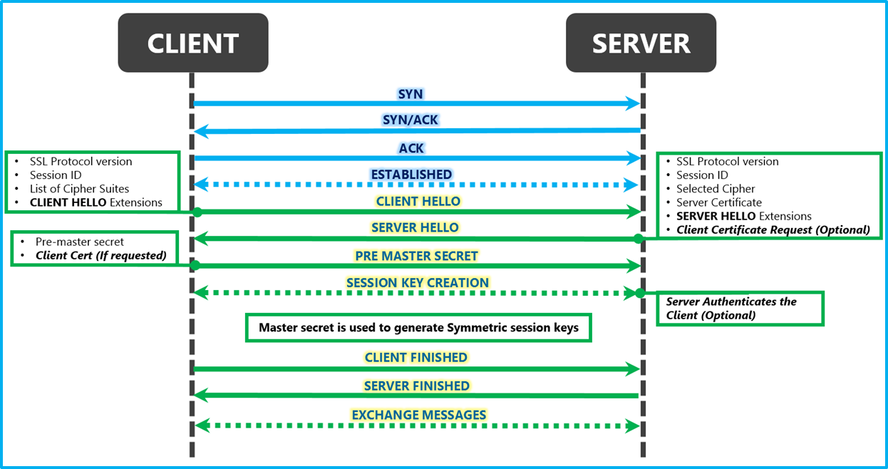

# TLS Protocol


Before reading this page you should first understand the cryptography series before:

1. [Hash functions](hash-functions.md)
2. [Symmetric, Asymmetric and Hybrid cryptography](symmetric-asymmetric-and-hybrid-cryptography.md)
3. [Digital signatures & digital certificates](digital-signatures-and-digital-certificates.md)


TLS (Transport Layer Security) protocol ensures secure communication over a network by encrypting data transmission over two parties, providing confidentiality, integrity and authenticity for communication applications, such as email, web or file transfer. \
Its often called also SSL or TLS/SSL for historic reasons. SSL(Secure Socket Layer) was the old name of the protocol and its still present in tons of documentation and outdated systems, so some people still refer to it that way. Some even use TLS/SSL to cover everything and evade confusions. \
Just remember that they are the same, just different versions.\
\
To create a TLS connection we must first start like in real life, with the Handshake protocol, in but in systems it's a Three-Way Handshake. This protocol occurs at the very beginning of a TLS session, to establish a connection between a client and a server. Its the basic process before they can talk to each other. Their introduction.\
Once the session is established, the client and the server will follow steps to ensure that they are in tune and can create a private TLS session, they will agree to cryptographic parameters and authenticate each other's identities before sending any personal data. Once the process is done, both parties will have a common symmetric key that they can use confidently for the rest of the session.

\
We will see the protocol step by step for easier understanding, but first we have to understand how they start the session with the Three-Way Handshake.\
Part of the TCP (Transmission Control Protocol), the Three-Way Handshake uses a 3 step process to ensure that the device acting as client and the one acting as server see each other and are ready to exchange data.

1. **SYN:** The process begins with a client (initiating party) sending a TCP segment with the SYN(Synchronize) flag to the server. This segment contains information about the client and most importantly the ISN (Initial Sequence Number), which will be used to sequence data and maintain a structured order of packets during the session. It's a random 32-bit number that will serve as a reference point to start numbering the bytes transmitted, so they don't overtake one another or get lost in the way. From now on this is the number that will be used and incremented in the direction client -> server.
2. **SYN + ACK:** Upon receiving the client's SYN segment the server will respond by sending another TCP segment back to the client, this time with a SYN+ACK(Acknowledge) flag. \
   The SYN part of the segment will contain its own, different, server side ISN random number and it will be used in the direction server -> client. \
   The ACK part of the segment will validate that the server in fact has received the client's SYN correctly by sending back the client's ISN number+1, proving that it was received, as nobody could know the result of that random number +1.
3. **ACK:** Finally, upon receiving the SYN+ACK from the server, the client sends another TCP segment with an ACK flag. Sending back the server's ISN number +1, proving too that it was received. \

From now on they will use both ISN numbers in each direction to verify that every byte has reached its destination, adding the exact number of bytes what will be transmitted to the ISN number before sending them away. Its like each party counts its own bytes and manages its own sequence number, so they are sure not even 1 byte of data was lost in the way when the recipient side confirms the ISN addition and the bytes received are the same.&#x20;

\
Here's an in depth [video](https://www.youtube.com/watch?v=rmFX1V49K8U) about the Three-Way Handshake protocol using Wireshark for visual understanding.

<figure><figcaption>
source: <a href="https://afteracademy.com/blog/what-is-a-tcp-3-way-handshake-process/">https://afteracademy.com/blog/what-is-a-tcp-3-way-handshake-process/</a> 
</figcaption></figure>

Once the TCP session is established, it's time to create a TLS private connection. We will look at each step:

1. CLIENT HELLO:&#x20;
2. SERVER HELLO:&#x20;

<figure><figcaption>
source: 
</figcaption></figure>


Its important to clarify that using the TLS protocol, AKA getting the HTTPS padlock, doesn't mean that the site is safe, just that the connection is encrypted, meaning private and that there are no eavesdroppers. Bad actors can and will obtain digital certificates too.&#x20;

