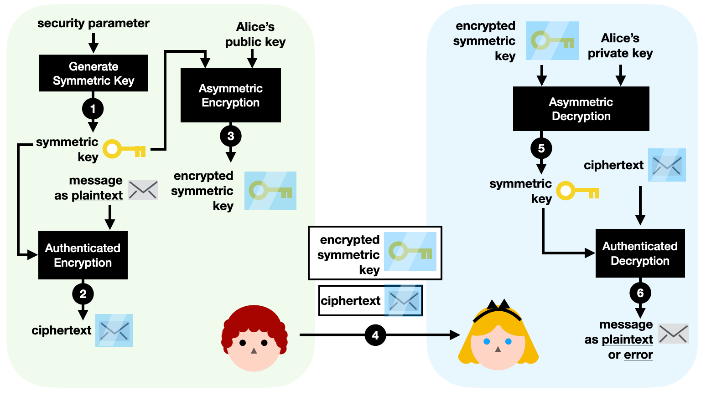

# Symmetric, Asymmetric and Hybrid cryptography

In this page we will focus on how cryptography is used to provide [confidentiality.](../pentesting-methodology-and-techniques/cia-triad-confidentiality-integrity-and-availability.md)&#x20;

### Symmetric cryptography

Also known as private key cryptography, is characterized for using the same key for both encryption and decryption of data. \
In cryptography a key is a string of alphanumeric characters that will be used as a pivotal piece in an algorithm. The chosen algorithm will scramble data in a random-looking, but in fact precise way, determined by the key. \
Different key strings will produce different outputs. \
The same key string will always produce the same output.\
It can be understood basically as a password because only that key will recover the data to its original state. \
\
We will understand better with the classic example of [Alice and Bob](https://en.wikipedia.org/wiki/Alice\_and\_Bob):

1. Suppose Bob wants to send the following secret message: "Tonight meeting at the docks" to Alice.
2. Using specialized software that executes an encryption algorithm, for example AES, Bob encrypts the text file with the following key: "myStr0ngP4ssw0rd1".
3. Bob's message now looks something like this "Yjq94KmniIi02reN=".
4. Now Bob sends it over the internet to Alice with total confidence that even if intercepted, nobody will be able to read it unless they know the key.
5. Once the encrypted message arrives at Alice's system, she will use the same or different software to execute the same algorithm AES but inverse, this time decrypting the file, using the same key "myStr0ngP4ssw0rd1" and she will be able to read the original message.

But there's a flaw in this method. How do we send the key over securely in the first place? If a bad actor intercepts the key it will have access to all our communications. It would be too much effort to find a secure tunnel or meet with the person to share it every time. Its not realistic for the average user. \
The best solution would be that every system had its own secret key and no need to share it ever.\
And that's why [three](https://en.wikipedia.org/wiki/Whitfield\_Diffie)[smart ](https://en.wikipedia.org/wiki/Martin\_Hellman)[guys](https://en.wikipedia.org/wiki/Ralph\_Merkle) invented asymmetric public key cryptography.\
\
But don't underestimate, symmetric cryptography has a big advantage, it's way more efficient, fast and can be used easily to encrypt storage devices(and so full systems) with a password. Also it can be used in conjunction with asymmetric cryptography to send over the symmetric key in a secure way and then both systems could use the same key. This is called hybrid cryptography and uses the best of both worlds, we will understand all of this below.


Popular symmetric cryptography algorithms:&#x20;

* AES (Advanced Encryption Standard): former name Rjindael, by far the most used in the world and "known" to be used in intelligence agencies. Selected and renamed as the standard encryption algorithm in 2001. As the year of writing this, 2023, it keeps being the standard and the best with no significant vulnerabilities.
* DES (Data Encryption Standard): old standard, adopted in 1977 and retired in 2005, the main flaw being the key bit length being too short for today's brute force attack standards.
* 3DES (Triple DES): applies DES algorithm 3 times to each data block, fixing the short key length flaw. While less secure and efficient than AES, it's still used in some legacy systems.
* Other secure algorithms not widely adopted because they are less efficient include: Serpent, Twofish, Blowfish, ChaCha20, MARS, IDEA...

While others may be secure, I would always recommend AES as its the most adopted by far. Think of it this way: with the whole world looking for flaws at the same algorithm, if there were, they would already been made public.



Recommended software for storage encryption [VeraCrypt](https://www.veracrypt.fr/en/Home.html)


***

### Asymmetric cryptography

Also known as public key cryptography, used mostly for securing connections, is the cryptographic method of encrypting or signing data using two different but mathematically related keys, one will be called public and the other private. \
Whatever data one key encrypts, only the other related key will be able to decrypt it.\
The public key will be shared with the world and the private will stay protected in our system. This method is widely used on all communications, for example, in the TLS protocol which makes HTTPS connections possible.

\
Again, its easier with our friends Alice and Bob:

1. First Bob and Alice create a public/private key pair in their own system. In HTTPS connections for example, the keys are created automatically and will be temporary for an specific connection.
2. Then Bob and Alice interchange public keys. Because they are worthless without its private counterpart they can be sent all over the internet and even posted on their social media.
3. Now that public keys are shared and in each other systems, Alice will write a message, encrypt it using Bob's public key, and sent over to Bob. This means no other key than Bob's private can decrypt that message, and that private key is never shared. So no matter who is eavesdropping the connection, all they will see is gibberish.&#x20;
4. Bob receives the encrypted message, decrypts and reads it. He then decides to respond so he writes a message and encrypts it with Alice's public key, and sends it over, repeating the process.

Real life has extra steps, signs and certificates involved, we will see them little by little in next pages.

<figure><figcaption>
source: <a href="https://twitter.com/kosamari/status/838738015010848769">https://twitter.com/kosamari/status/838738015010848769</a> 
</figcaption></figure>


RSA ([Rivest](https://en.wikipedia.org/wiki/Ron\_Rivest)-[Shamir](https://en.wikipedia.org/wiki/Adi\_Shamir)-[Adleman](https://en.wikipedia.org/wiki/Leonard\_Adleman)) is the standard asymmetric algorithm used as of 2023 and has been for decades. The security is based on the difficulty of factoring the product of two large prime numbers. Something not even computers can quickly calculate.&#x20;


***

### Hybrid cryptography

Also called hybrid cryptosystem, is an approach that combines the strengths of both symmetric and asymmetric systems. Its ideal for transmitting big data or creating faster secure communications as once the symmetric key is shared the asymmetric is no longer needed. It consists on using asymmetric cryptography to encrypt a symmetric key that will be then sent and used for normal data encryption/decryption. We will understand again with an example.

Transmitting big files with Alice and Bob:

1. First Bob and Alice generate an asymmetric key pair and share the public one. But only Bob generates a symmetric key.
2. Bob then proceeds to encrypt the big file with the symmetric key, way faster.
3. Bob then, encrypts the symmetric key with Alice's public key, making it secure for the transfer.
4. Bob sends both the asymmetric encrypted symmetric key and the symmetric encrypted data to Alice, both things are encrypted and secure.
5. Now Alice uses his private key to decrypt the symmetric key then uses it to decrypt the big file, way faster than using only asymmetric cryptography.

Notice how now both have a symmetric key they only know in their systems, this is called "symmetric key exchange" and with extra steps, its called TLS protocol, the one that makes HTTPS possible. \
"HTTPS = HTTP + TLS"\
We will see and understand the whole protocol in next pages.\

<figure><figcaption>
source: <a href="https://livebook.manning.com/book/real-world-cryptography/chapter-6/v-14/181">https://livebook.manning.com/book/real-world-cryptography/chapter-6/v-14/181</a> 
</figcaption></figure>
