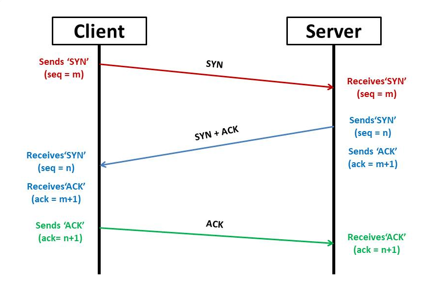
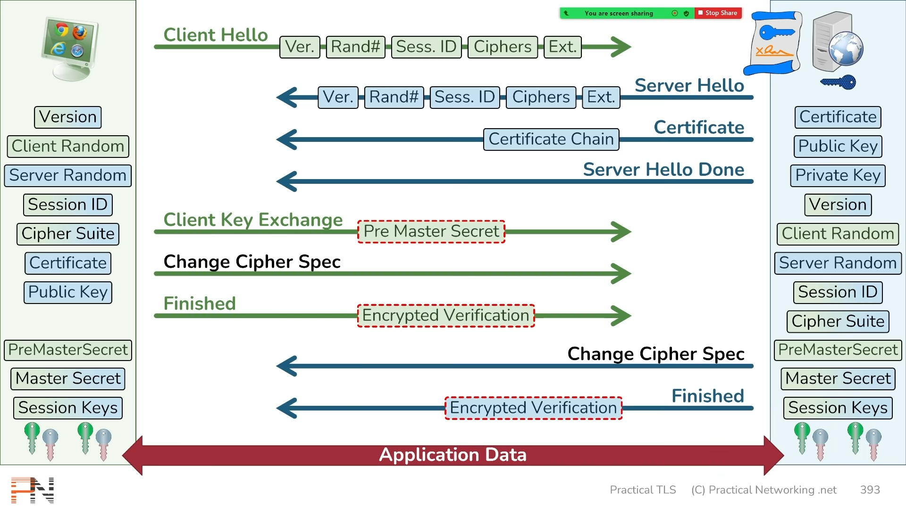

# TLS Protocol


Before reading this page you should first understand the cryptography series before:

1. [Hash functions](hash-functions.md)
2. [Symmetric, Asymmetric and Hybrid cryptography](symmetric-asymmetric-and-hybrid-cryptography.md)
3. [Digital signatures & digital certificates](digital-signatures-and-digital-certificates.md)


TLS (Transport Layer Security) protocol ensures a secure and private communication over a network by encrypting data transmitted between two parties, providing confidentiality, integrity and authenticity for communication applications such as email, web or file transfer. \
Its often called also SSL or TLS/SSL for historic reasons. SSL(Secure Socket Layer) was the old name of the protocol and its still present in tons of documentation and outdated systems, so some people still refer to it that way. Some even use TLS/SSL to cover everything and evade confusions. \
Just remember that they are the same, just different versions.\
\
To create a connection we must first start like in real life, with a handshake, but in systems it's kinda special, its a Three-Way Handshake. This protocol occurs at the very beginning of a TLS session, to first establish a non-encrypted connection between a client and a server, the basic process before they can talk to each other. Their introduction.\
Once the handshake is done, the client and the server will follow steps to ensure that they are in tune and can create a secure TLS session, they will agree to cryptographic parameters and authenticate each other's identities before sending any personal data. Once the process is done, both parties will have symmetric keys that they can use confidently for the rest of the session.

\
We will learn the protocol way easier step by step.\
\
First we have to understand how they start the session with the Three-Way Handshake.\
As it is a big part of the TCP (Transmission Control Protocol), the Three-Way Handshake its connection oriented, so it uses a 3 step process to ensure that the device acting as client and the one acting as server see each other and are ready to exchange data without losing any in the way or recovering if needed.&#x20;

1. **SYN:** The process begins with a client (initiating party) sending a TCP segment with the SYN(Synchronize) flag to the server. This segment contains information about the client and most importantly the ISN (Initial Sequence Number), which will be used to sequence data and maintain a structured order of packets during the session. It's a random 32-bit number that will serve as a reference point to start numbering the bytes transmitted, so they don't overtake one another or get lost in the way. From now on this is the number that will be used and incremented in the direction: client -> server.
2. **SYN + ACK:** Upon receiving the client's SYN segment the server will respond by sending another TCP segment back to the client, this time with a SYN+ACK(Acknowledge) flag. \
   The SYN part of the segment will contain its own, different, server side ISN random number and it will be used in the direction: server -> client. \
   The ACK part of the segment will validate(or acknowledge) that the server in fact has received the client's SYN correctly by sending back the client's ISN number+1, proving that it was received, as nobody could know the result of that random number +1.
3. **ACK:** Finally, upon receiving the SYN+ACK from the server, the client sends another TCP segment with an ACK flag. Sending back the server's ISN number +1, proving too that it was received. Now they know both ISN values, are synchronized, and ready to start "talking".\

From now on they will use both ISN numbers in each direction to verify that every byte has reached its destination, adding the exact number of bytes that will be transmitted to the ISN number before sending them away. Each party counts its own bytes and manages its own sequence number, so they are sure not even 1 byte of data was lost in the way, when the recipient side confirms that the ISN addition and the bytes received are the same.&#x20;

\
Here's an in depth [video](https://www.youtube.com/watch?v=rmFX1V49K8U) about the Three-Way Handshake protocol using Wireshark for visual understanding.

<figure><figcaption>
source: <a href="https://afteracademy.com/blog/what-is-a-tcp-3-way-handshake-process/">https://afteracademy.com/blog/what-is-a-tcp-3-way-handshake-process/</a> 
</figcaption></figure>

Once the handshake is done, a TCP session is established, it's time to create a TLS private connection. We will look at each step of the TLS handshake, below is an image that I recommend to check in parallel with each step:

1. **CLIENT HELLO:** the client will send a "Client Hello" flagged message to the server, it will include among other information the supported TLS versions, cipher suites AKA list of cryptographic algorithms supported ordered by preference, another list of compression algorithms supported and a random number called SEED that will contribute to the generation of the keys, we will see that later. If they have a previous session ID it will be shared too.
2. **SERVER HELLO:** the server responds with a "Server Hello" flagged message to the client, its the same as the "Client Hello" but with information from the server. Once they shared this information they will go with the highest TLS version compatible for both, the server will choose the cipher algorithms from the lists and they will have each other random numbers.
3. **SERVER CERTIFICATE:** along with the "Server Hello", the server will send its full certificate chain, meaning the certificate plus the certificates of who issued those certificates. Inside the certificate it's the server's public key.
4. **SERVER HELLO DONE:** along with the "Server Hello" and the "Server certificate" the servers sends the "Server Hello Done" flag to let know the client that it has finished sending data, as other versions of the handshake could have additional packets. This lets know the client that the server has finished and is waiting for its response. This message its empty.
5. **Client Key Exchange:** the client will now generate a **Pre-Master secret**, a 48byte random number, encrypt it with the server's public key and send it, so now both parties have this random number that they only know. (Note the random numbers sent before were not encrypted).\
   Now using a deterministic pseudo-random function (PRF)(similar to hashing) they both generate the same **Master secret**(another random number), using as seed parameters:\
   1\. Both random numbers sent early in the "client/server hello" (from now on called SEED values)\
   2\. The literal string "master secret" (yes, literally those 2 words and the space between)\
   3\. The pre-master secret.\
   \
   Now again, with another PRF, using as seed the same SEED values, the literal string "key expansion" and the just created Master secret, they will create the **four symmetric session keys**.\
   \
   The PRF will be used as needed until they obtain the quantity of bits necessary for the keys plus other possible key material needed. So if they chosen AES-128 and SHA256 for example:\
   2 keys of 128bits + 2 keys of 256bits would need 768 bits from the PRF. \
   (Note: even if SHA256 does not encrypt(it hashes), the length of the hashing algorithm is important in the creation of the key because the HMAC key has to match the same length as the algorithm, we will understand this below.)\
   \
   The session keys are 4 symmetric keys, both client and server have this 4 keys.\
   They will be used to create 2 secure unidirectional tunnels, one going "client -> server" using the client's key pair and the other going "server -> client" using the server's key pair. This is done because in case the client and the server were to send the same exact value, for an easy example the word "p4ssw0rd", if the keys were the same, the encrypted data coming and going would be the same, and a bad actor could extract information using that. But being 2 different sets of keys, even if the word is the same, the encrypted result sent over the wire will be different. \
   Also if someone was able to brute-force a set of keys, suppose the client ones, it would still have only one direction of the connection, the data coming from the server would still be encrypted, making it difficult to steal data.


1. **Client encryption key:** for confidentiality, symmetric key that will be used to encrypt/decrypt the data going in the direction "client -> server" by both parties.
2. **Client HMAC key:** (Hash-based Message Authentication Code) for integrity and authenticity, this key will be used by the client to create a digital signature, that will be a hash of the input of the message in combination with the key itself. \
   Only the combination of this key plus the message will produce the same hash value. But this key never leaves the client or the server. So even if a bad actor intercepts the message, creates a new one and hashes it trying to fool the server, it will never match, because the server will combine the client's HMAC key to the message before hashing and the output will be different. The bad actor would need the HMAC key to produce a valid hash.
3. **Server encryption key:** for confidentiality, symmetric key that will be used to encrypt/decrypt the data going in the direction "server -> client" by both parties.
4. **Server HMAC key:** same purpose as the client HMAC, in the unidirectional tunnel in the direction "server -> client".&#x20;



Remember those are symmetric keys, so the client will use his keys to encrypt, sign and send data to the server, and the server will use the same client keys to decrypt everything, and vice-versa. This way once created they don't have to leave the system, since both parties have the keys of each other.


Now both parties have the session keys, but they need to prove it and check that nothing went wrong in the way, remember this is TCP.

6. **Change Cipher Spec:**  the client sends a single-byte message flagged "Change Cipher Spec", that confirms to the server that the client has everything it needs to start talking securely and that from now on everything it sends will be encrypted with the session keys.
7. **Finished:** along "Change Cipher Spec" the client sends another message flagged as "Finished" that will validate the "Change Cipher Spec" assumption that everything is okay. This will contain an encrypted verification that will prove that the client has the right keys and that nothing has been tampered in the whole process. \
   This will be done by creating a hash with the contents of all the handshake records sent so far: Client Hello, Server Hello, Certificate, Server Hello Done and Client Key Exchange. \
   (Note: Change Cipher Spec messages aren't included because they are not exactly handshake records, just a single-byte message that indicates subsequent records will be encrypted, like a switch) \
   This is used to prevent downgrade attacks, as a bad actor could try to tamper the client/server hello messages(remember, those are not encrypted) into using an old vulnerable version of the protocol for example. But verifying this hash validates that the client and the server both saw the same "hello" with the TLS version accorded. Then the handshake hash will be passed to a PRF in combination with the master key and the string "client finished" to create the "verification data" that will be encrypted with the client session keys and finally sent to the server as the "encrypted verification".\
   The server will be able to obtain the same verification data as it supposedly saw the same records along the way. If even the slightest thing is changed the verification data result would be totally different and the connection deemed insecure. \
   If the server can decrypt and match the verification this proves that the client in fact has the correct "client session keys" and the server the same ones.
8. **Server's Change Cipher Spec:** the server sends the same confirmation as the client that everything is OK and its ready to start using the session keys to encrypt everything.
9. **Server's Finished:** the sever is going to essentially repeat the same process to sent its own "encrypted verification" but adding to the hash mix the just received "Finished" record to prove it arrived OK too. The server will use too a PRF with the hash just created, the master secret and the string "server finished" to create its own "verification data" but this time it will be sent over encrypted with the server session keys. If the client can validate everything this verifies that the client and the server has the same server session keys, meaning that the server in fact had the correct Master secret, therefore the correct Pre-Master secret, therefore the correct Private key and therefore is the rightful owner of the CA certificate.
10. **Application data:** now both parties have secure symmetric keys in their systems that no one else in the world has, they are ready to use them to send actual application data.\

<figure><figcaption>
source: <a href="https://youtu.be/25_ftpJ-2ME?feature=shared">https://youtu.be/25_ftpJ-2ME</a>
</figcaption></figure>

For a more in depth and visual explanation using Wireshark you can watch this [video](https://www.youtube.com/watch?v=25\_ftpJ-2ME).&#x20;


TLS protocol is super secure and complex and amazing, but its important to clarify that using it, AKA getting the HTTPS padlock, doesn't mean that the site is safe, just that the connection is encrypted, meaning private, and that there are no eavesdroppers. \
Bad actors can and will obtain digital certificates too.&#x20;

