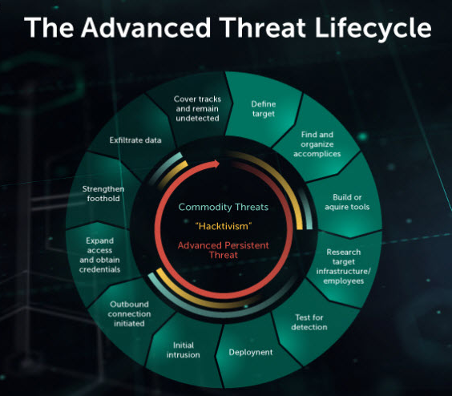

# APT - Advanced Persistent Threat

By definition the most complex and dangerous cyberattack. APT is a term used to describe an attack campaign, in which, usually a team of highly trained actors, using sophisticated techniques and lots of resources, end up establishing a long term presence on a big target in order to exfiltrate very valuable data or do significant damage.\
\
Here we are talking about a really shady world.\
The targets of these campaigns are thoroughly chosen and researched, usually being large enterprises or governmental entities. APT actors are looking to steal intellectual property valued in numbers that would make your typical robbery look like a children's game. Money is not all tho, they also can focus on stealing government data, industry secrets, performing political espionage...\
We are talking crimes worth decades of jail time. \
Although the concept of APT could be done by anybody with time, skills and resources, realistically they are mostly carried by organized groups of individuals, be mafia or nation-state promoted, pursuing concrete and very lucrative objectives, due to the enormous resources needed and the risk it supposes.  \
\
We could categorize three types of threats by complexity. First "commodity threats", your typical hacker using already made malware, ransoming some small companies, stealing credit cards etc. Then there is Hacktivism, normally compromised by a group of individuals or even on a public call to arms, more sophisticated but mainly looking to send a quick message and run, rather than searching financial benefit. And the APTs we have been talking about, where actors have to dedicate tons of time/money while risking their integrity, campaigns often follow a lifecycle designed in these 12 steps:\

<figure><figcaption>
source: <a href="https://www.kaspersky.com/resource-center/threats/advanced-persistent-threat">https://www.kaspersky.com/resource-center/threats/advanced-persistent-threat</a> 
</figcaption></figure>

1. **Define target:** determine who you are targeting, why, how, and what you hope to accomplish, has to be a really good pitch to convince other actors.
2. **Find and organize accomplices:** identify required skills for the job, select personnel accordingly and try to bribe insiders.
3. **Build or acquire tools:** do an inventory of what's needed, try to find available tools to save time but end up assigning team members to build specialized tools for the job themselves.
4. **Research target:** in parallel while building the tools, try to discover what hardware and software the target uses to design code accordingly, look for the hierarchy of the company, employees with privileges, easy victims, social engineering enters the scene.
5. **Test for detection:** deploy small reconnaissance, small versions of your malware, test alarms, communications, try to identify weak spots and adapt.
6. **Deployment:** initiate the attack, begin the infiltration, apply all the theory to practice.
7. **Initial intrusion:** once inside the network, look for the structure, valuable targets, ways to expand and escalate privileges. Begin moving towards the objective.
8. **Outbound connection initiated:** begin exfiltrating data, create a safe tunnel and evade all detection systems, remain undetected while getting intel from the inside.
9. **Expand access and obtain credentials:** try to gain as much control as possible, it will grant movement and expansion on the attack, work your way up from low privileged credentials to root accounts.
10. **Strengthen foothold:** work on persistence, you want as much time inside as you can obtain, establish backdoors, zombies, extend the attack to other locations...
11. **Exfiltrate data:** you have the objective now, nobody realized and persistence is established, use the secure tunnels to get the bounty outside.
12. **Cover tracks and remain undetected:** clean up after yourself, stay hidden for future incursions and to evade activating damage control protocols, the best hack is the one nobody even knows happened.

