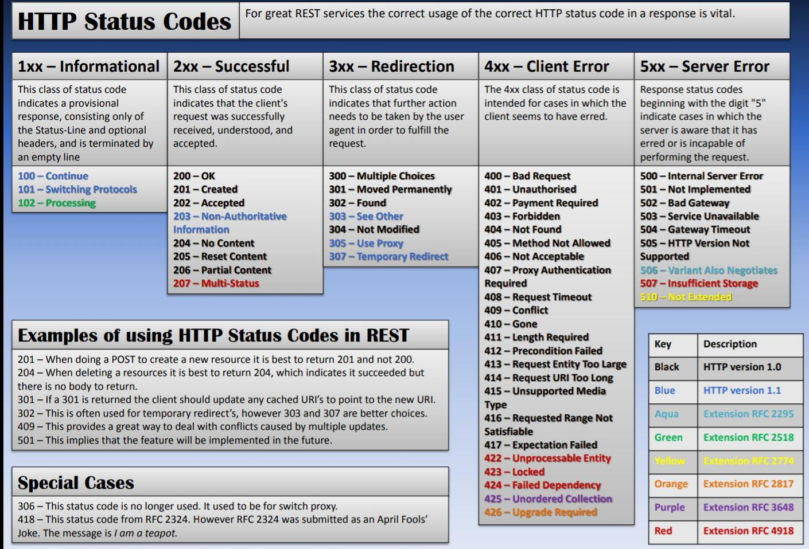

# HTTP status codes

<figure><figcaption>
source: <a href="https://www.reddit.com/r/cybersecurity/comments/fwe9ud/http_response_status_codea_must_cheatsheet_for/">https://www.reddit.com/r/cybersecurity/comments/fwe9ud/http_response_status_codea_must_cheatsheet_for/</a> 
</figcaption></figure>

